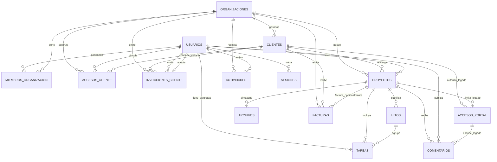

# Equinox: Modelo de Datos y Diagrama Entidad-Relación

Este documento describe la arquitectura de datos de **Equinox**, detallando las entidades, sus relaciones, los principios de aislamiento multitenant y el flujo de cuentas e invitaciones para clientes.

---

## 1. Diagrama Entidad-Relación (Mermaid)

---

## 2. Diccionario de Entidades

| Entidad | Propósito | Relaciones Clave |
|---|---|---|
| **Usuario (`usuarios`)** | Cuenta personal con credenciales únicas (correo y contraseña). Identifica a propietarios, colaboradores o clientes. | Se relaciona con membresías de estudio, accesos de cliente, sesiones, tareas asignadas, comentarios y actividades. |
| **Organizacion (`organizaciones`)** | Representa el estudio o negocio del freelancer; contiene marca, moneda, datos fiscales y configuración. | Contiene clientes, proyectos, miembros, facturas, invitaciones y registro de actividades. |
| **MiembroOrganizacion (`miembros_organizacion`)** | Vincula a un usuario interno con un estudio bajo un rol (`PROPIETARIO` o `COLABORADOR`). | Controla el acceso administrativo y operativo al espacio del freelancer. |
| **Cliente (`clientes`)** | Ficha comercial de una persona o empresa contratante del estudio. | Pertenece a una organización. Agrupa proyectos, facturas, accesos autorizados e invitaciones. |
| **AccesoCliente (`accesos_cliente`)** | Relación explícita N:M entre una cuenta de usuario personal y una ficha de cliente comercial. | Asigna un rol (`TITULAR` o `COLABORADOR`), estado activo y fecha de último acceso. Impide duplicados (`usuario_id`, `cliente_id`). |
| **InvitacionCliente (`invitaciones_cliente`)** | Invitación temporal, revocable y de un solo uso enviada al correo de un contacto de cliente. | Guarda el hash del token (`token_hash`), fechas de expiración/aceptación, emisor y receptor. |
| **Proyecto (`proyectos`)** | Trabajo o entregable contratado para un cliente. | Pertenece a una organización y cliente. Agrupa tareas, hitos, archivos, comentarios y facturas. |
| **Tarea (`tareas`)** | Tarea operativa o pendiente dentro de un proyecto. | Puede pertenecer a un hito y estar asignada a un usuario responsable. |
| **Hito (`hitos`)** | Etapa o fecha clave del avance del proyecto visible para el cliente. | Organiza y agrupa tareas dentro de un proyecto. |
| **Archivo (`archivos`)** | Metadatos y URLs de entregables o documentos adjuntos. | Clasificados por visibilidad (`INTERNA` o `CLIENTE`). |
| **Comentario (`comentarios`)** | Mensajes e interacción en torno a un proyecto. | Autoría por `Usuario` (o `AccesoPortal` temporal legado). |
| **Factura (`facturas`)** | Cobros, vencimientos y estados de pago emitidos por el estudio. | Emitida para un cliente y opcionalmente asociada a un proyecto. |
| **Actividad (`actividades`)** | Bitácora de auditoría y eventos ocurridos en la organización. | Registra usuario actor, entidad afectada, acción y fecha. |
| **Sesion (`sesiones`)** | Sesiones activas y revocables con tokens JWT cifrados. | Asociadas a la cuenta de usuario personal. |
| **AccesoPortal (`accesos_portal`)** *(Legado)* | Enlaces permanentes sin contraseña para portal de cliente. | **Modelo heredado**, mantenido para compatibilidad hasta la Issue #5. |

---

## 3. Principios y Decisiones de Arquitectura

### 3.1. Diferencia entre Cuenta de Usuario y Ficha de Cliente

- **Ficha de Cliente (`Cliente`)**: Representa la entidad comercial (nombre, empresa, RUC, dirección, proyectos asociados, historial de facturación). La ficha pertenece al estudio del freelancer.
- **Cuenta de Usuario (`Usuario`)**: Representa una identidad personal y credenciales de acceso (correo único, contraseña hash, sesiones).
- **Desacoplamiento**: La ficha de cliente **no es una cuenta de usuario** ni se reemplaza por ella. Una empresa cliente (ej. *"Café Unido S.A."*) puede tener múltiples personas autorizadas (ej. gerente de marca, director financiero), cada una con su propia cuenta personal vinculada mediante `AccesoCliente`.

### 3.2. Funcionamiento de las Invitaciones (`InvitacionCliente`)

1. **Emisión**: El freelancer genera una invitación desde el estudio para un cliente determinado, indicando el correo del destinatario y el rol propuesto (`TITULAR` o `COLABORADOR`).
2. **Seguridad y Token Hash**: Se genera un token criptográfico seguro de un solo uso. En la base de datos **solo se almacena el hash del token (`token_hash`)**, garantizando que el token original no pueda ser expuesto en caso de filtración de datos.
3. **Temporalidad y Estados**: La invitación tiene una fecha de vencimiento (`expira_en`) y un ciclo de vida definido por `EstadoInvitacionCliente`:
   - `PENDIENTE`: Invitación activa esperando ser aceptada.
   - `ACEPTADA`: El usuario aceptó la invitación y se generó su `AccesoCliente`.
   - `REVOCADA`: El freelancer canceló la invitación antes de su uso.
   - `EXPIRADA`: La fecha actual superó `expira_en` sin haberse aceptado.
4. **Unicidad y Reutilización de Cuentas**:
   - Si el invitado no tiene cuenta en Equinox, el flujo lo guía a crear su cuenta con correo y contraseña.
   - Si el invitado ya posee una cuenta (incluso como colaborador o cliente de otro estudio), la aceptación simplemente registra el nuevo `AccesoCliente` sin duplicar cuentas ni requerir un nuevo registro.

### 3.3. Vinculación de una Cuenta con Uno o Varios Clientes

- La entidad `AccesoCliente` implementa una relación muchos-a-muchos limpia entre `Usuario` y `Cliente`.
- La restricción de unicidad `@@unique([usuarioId, clienteId])` previene vinculaciones redundantes.
- Una misma cuenta de usuario puede participar:
  - Como `PROPIETARIO` en su propia organización.
  - Como `COLABORADOR` en otra organización.
  - Como contacto `TITULAR` o `COLABORADOR` para uno o más clientes en distintas organizaciones.

### 3.4. Conservación del Aislamiento Multitenant por Organización

- Toda entidad principal (`Cliente`, `Proyecto`, `Factura`, `Actividad`, `AccesoCliente`, `InvitacionCliente`) contiene una referencia directa e indexada a `organizacionId`.
- Al realizar consultas, el backend valida que las operaciones se ejecuten dentro de la organización activa del usuario o de los clientes a los que tiene acceso explícito mediante `AccesoCliente`.

---

## 4. Compatibilidad Temporal y Estrategia de Migración

- **Estado de `AccesoPortal`**: Se conserva temporalmente en el esquema de base de datos para no romper la compilación ni el funcionamiento de los endpoints existentes (`/api/portal/:token` y `/api/proyectos/:id/accesos-portal`).
- **Plan de Sustitución**:
  - **Issue #1 (Actual)**: Diseño y validación del esquema de Prisma para `Usuario`, `AccesoCliente` e `InvitacionCliente`.
  - **Issue #2**: Lógica de backend para envío, validación y aceptación de invitaciones.
  - **Issue #5**: Reemplazo definitivo de los endpoints basados en token de enlace por autenticación de clientes con sesión JWT, retirando formalmente el modelo `AccesoPortal`.
