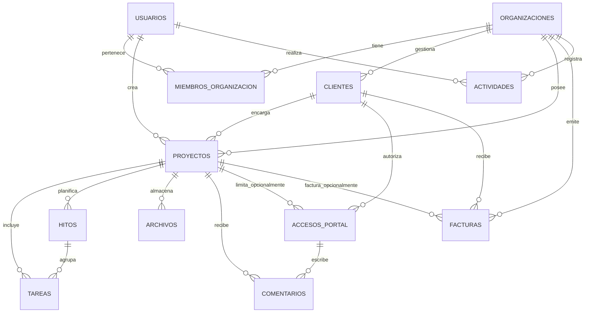

# Equinox: mapa de datos

Este diagrama muestra **quién guarda cada dato y cómo se relaciona**. Una organización representa el estudio del freelancer. Todo lo que pertenece a un estudio queda aislado de los demás.

| Entidad | Para qué sirve | Relación importante |
|---|---|---|
| Usuarios | Cuentas internas de quienes trabajan en Equinox. | Puede pertenecer a uno o varios estudios. |
| Organizaciones | El estudio o negocio del freelancer; incluye su marca y configuración. | Tiene clientes, proyectos y facturas. |
| Miembros de organización | Une un usuario con un estudio y guarda su rol. | Evita que alguien acceda a otro estudio. |
| Clientes | Personas o empresas que contratan al estudio. | Un cliente puede tener varios proyectos y accesos al portal. |
| Proyectos | Trabajo contratado para un cliente. | Agrupa tareas, hitos, archivos y comentarios. |
| Tareas | Trabajo diario que se completa dentro de un proyecto. | Puede pertenecer a un hito y asignarse a un usuario. |
| Hitos | Fechas o etapas relevantes del proyecto. | Sirven para explicar avance al cliente. |
| Archivos | Adjuntos y entregables. | Los de visibilidad `CLIENTE` aparecen en el portal. |
| Comentarios | Feedback del freelancer o del cliente. | El cliente comenta mediante su acceso de portal. |
| Accesos de portal | Enlaces únicos para entrar sin contraseña. | Pueden dar acceso a todo un cliente o solo un proyecto. |
| Facturas | Cobros y estado de pago. | Se emiten para un cliente y opcionalmente un proyecto. |
| Actividades | Bitácora de cambios para historial y auditoría. | Registra quién hizo qué y cuándo. |
| Sesiones | Sesiones revocables para autenticación interna. | Se vinculan a un usuario. |

## Reglas clave

- Un token de portal solo es válido si está activo y no ha vencido.
- Un acceso de portal sin proyecto da acceso a todos los proyectos de ese cliente; si tiene proyecto, solo a ese.
- Al eliminar un proyecto se eliminan sus tareas, hitos, archivos y comentarios. Un cliente no puede eliminarse si conserva proyectos o facturas, salvo que se gestione explícitamente.
- `actividades` conserva el historial; los datos principales incluyen fecha de creación y actualización.
